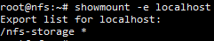
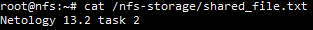

# Домашнее задание к занятию «Хранение в K8s. Часть 2» Соловьев Д.В.
1. Kubernetes manifest файлы для [PV и PVC](./kubernetes%20manifests/persistemntVolume.yaml) и для [деплоймента с busybox и multitool](./kubernetes%20manifests/deployment.yaml).  
   Запущенные PV, PVC, и деплоймент, а также демонстрация чтения файла в который каждые 5 секунд сохраняется новая строчка:  
     
   PV перешёл в статус ```Failed``` после удаления деплоймента и PVC:  
     
   Узнать причину этого можно при помощи команды: ```kubectl describe pv local-volume```. Применив команду получаем следующий вывод:  
     
   Из него можно сделать вывод, что Kubernetes не имеет плагина для удаления раздела для PV с типом local-storage  
   После удаления PV файл также остался нетронутым:  
     
   Происходит это т.к. Kubernetes не имеет автоматической очистки данных после PV с типом Local-storage и согласно [документации](https://kubernetes.io/docs/concepts/storage/volumes/#local) требует очистки вручную.

2. Поскольку я использую не MikroK8s а облачный Kubernetes, то я поднял NFS сервер на соседней виртуальной машине:  
     
   Kubernetes manifest файлы для [PV и PVC](./kubernetes%20manifests/persistemntVolume2.yaml) и для [деплоймента с multitool](./kubernetes%20manifests/deployment2.yaml).  
   Запущенные PV, PVC и деплоймент, а также демонстрация возможности чтения и записи в файл:  
     
   Тот же файл на NFS сервере:  
   